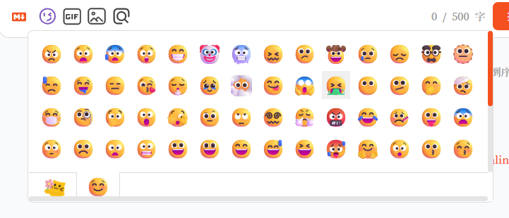

# Fluent Emoji

Emoji 表情是风靡全球的表情包，通用性很强，包含大量的人物和食物等各种形象，俗称黄豆表情。随着 Windows 11 操作系统的新版本发布，微软对内置的 Emoji 表情进行更新，把之前的 2D 扁平风格更新到 3D 风格，看上去更加具有立体活泼感。本月的11日，微软宣布开源了这套表情包，让更多的创作者可以使用 Fluent Emoji


## 如何使用

由于完整的 `fluent-emoji` 内的表情实在是太多了（1000个以上）考虑到作为评论区的表情没有必要完整移植过来，所以我在 [v1.1](https://github.com/weekdaycare/waline-fluentemoji/tree/v1.1) 仅保留了小黄脸的表情，当然，如果你想使用完整的表情包也是可以的，[v1.0](https://github.com/weekdaycare/waline-fluentemoji/tree/v1.0) 保留了所有表情

- v1.1 小黄脸表情
  
  
  
  ```yaml
  https://gcore.jsdelivr.net/gh/weekdaycare/waline-fluentemoji@v1.1/assets
  ```

- v1.0 全部表情
  
  ```yaml
  https://gcore.jsdelivr.net/gh/weekdaycare/waline-fluentemoji@v1.0/assets
  ```

接下来你只需要参考 waline [官方文档](https://waline.js.org/guide/features/emoji.html)即可

玩的愉快！

## Code of Conduct

This project has adopted the [Microsoft Open Source Code of Conduct](https://opensource.microsoft.com/codeofconduct). For more information see the [Code of Conduct FAQ](https://opensource.microsoft.com/codeofconduct/faq/) or contact opencode@microsoft.com with any additional questions or comments.
